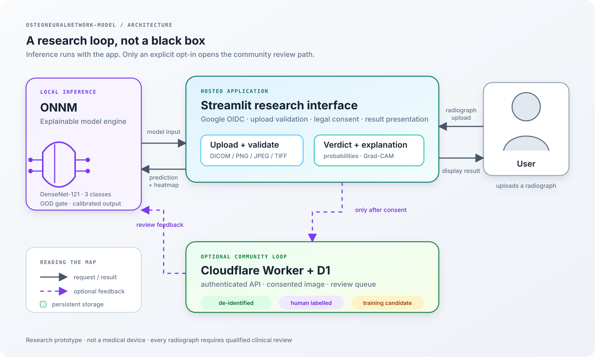

# OsteoNeuralNetwork-Model

<p align="center">
  
</p>

<p align="center">
  <a href="https://osteoneuralnetwork-model-af5ynv9qxg7u8rc5epdprr.streamlit.app"><strong>Try the hosted research demo</strong></a>
  · <a href="MODEL_CARD.md">Model card</a>
  · <a href="overview.md">Agent overview</a>
</p>

<p align="center">
  
  
  
  
</p>

## Stack at a glance

| Technology | Version / choice | Users |
|---|---|---|
| Python | 3.12 | **Live, D1-backed** |
| PyTorch | 2.9.1 + ROCm 7.2.1 | Google OIDC accounts |
| MONAI | 1.5.2 | Community submissions |
| Model | DenseNet-121 · 3 classes | `normal / benign / malignant` |
| Interface | Streamlit `>=1.42` | [Hosted demo](https://osteoneuralnetwork-model-af5ynv9qxg7u8rc5epdprr.streamlit.app) |
| Persistence | Cloudflare Worker + D1 | Live count is intentionally read from the protected D1 health tag, not hard-coded here |

> The current local Wrangler credentials point at a different Cloudflare account, so the protected live user counter could not be safely read while preparing this README. The deployment itself remains D1-backed; no user number has been guessed or fabricated.

## What this project is

ONNM is an explainable research prototype for triaging primary bone tumours from plain radiographs. It classifies each film as normal, benign, or malignant, then shows the evidence that drove the prediction with Grad-CAM.

The real-world problem is not simply “make a classifier.” Bone tumours are rare, radiographs are difficult to interpret consistently, and an apparently strong accuracy score can hide missed cancers. ONNM therefore focuses on the parts that make a model more useful to investigate:

- grouped patient-safe splits rather than randomly scattering multiple views across train and test;
- malignant recall, PR-AUC, confidence calibration, and bootstrap intervals rather than accuracy alone;
- an uncertainty/OOD gate that can withdraw a confident-looking call;
- Grad-CAM localisation scored against lesion boxes;
- a consent-based community loop where only de-identified 256px inputs enter D1 and only a human-approved label reaches training.

This is not a diagnostic device. It has no FDA, CE, or MHRA clearance. Every radiograph requires review by a qualified clinician.

## Architecture

The diagram above is animated on supporting SVG viewers: dashed request paths move left-to-right and the opt-in community packet travels into the review layer. The source is [assets/onnm-architecture.svg](assets/onnm-architecture.svg), so the labels stay version-controlled and readable instead of becoming an outdated screenshot.

The normal path is local to the app host:

1. A user uploads DICOM, PNG, JPEG, BMP, or TIFF.
2. The loader applies DICOM VOI/LUT rules, inverts MONOCHROME1 correctly, validates the payload, preserves aspect ratio, and produces a 256px model input.
3. DenseNet-121 returns the three-class probabilities; calibration and the uncertainty gate shape the displayed verdict.
4. Grad-CAM produces a visual explanation. The result page keeps the raw class breakdown visible beneath the simpler normal/lesion headline.
5. If the user opts in, the processed image and prediction are sent through the authenticated Worker into D1 for review. Sharing is never implied by uploading.

## How it was made

The project is deliberately more than a notebook wrapped in a web page. The implementation is split into small, testable boundaries:

| Layer | What it does |
|---|---|
| Radiograph I/O | Reads DICOM and common raster formats, honours VOI LUT and photometric interpretation, and strips metadata before community storage. |
| Dataset pipeline | Derives labels from BTXRD one-hot fields, reconstructs surrogate patient groups, creates leakage-resistant splits, and applies aspect-safe transforms. |
| Model | Uses ImageNet-shaped DenseNet-121 with a three-class head, calibrated probabilities, threshold selection on validation only, and Grad-CAM hooks. |
| Evaluation | Reports clinically meaningful class metrics, PR-AUC, bootstrap confidence intervals, reliability bins, malignant error paths, and lesion-localisation scores. |
| App | Provides Streamlit upload, OOD checks, inference, explainability, legal notices, Google OIDC, and per-user session handling. |
| Community backend | A guarded Cloudflare Worker validates payloads, applies per-user and storage caps, stores consent metadata, and exposes a human review gate before export. |
| Verification | Six gates plus a focused pytest suite catch environment, data, decoding, training, calibration, privacy, and backend regressions. |

The hardest engineering constraints are practical rather than decorative: ROCm on Windows has a training-mode MIOpen failure, Windows DataLoader workers can multiply the MONAI cache, the malignant class is only 9.1% of BTXRD, and a model can learn a shortcut such as a collimation edge instead of a lesion. The code treats those as explicit failure modes with checks and documented workarounds.

## Results, with the necessary caveats

The current full run uses DenseNet-121 and early stopping. On the held-out test split (`n=536`, never used for training or calibration):

| Class | Sensitivity | Specificity | PR-AUC | n |
|---|---:|---:|---:|---:|
| Normal | 0.859 | 0.805 | 0.886 | 269 |
| Benign | 0.757 | 0.852 | 0.847 | 218 |
| Malignant | 0.633 | 0.979 | 0.708 | 49 |

Macro ROC-AUC is **0.893**, macro PR-AUC **0.814**, and balanced accuracy **0.749**. The malignant recall interval is wide: **0.633 [0.490, 0.776]**. Six of 49 malignant films were called normal. Those numbers are why this repository presents the model as research software, not clinical advice.

## Run it locally

```powershell
python -m venv .venv
.venv\Scripts\python.exe -m pip install -e ".[dev]"
.venv\Scripts\python.exe -m streamlit run app.py
```

Open <http://localhost:8501>. A checkpoint is required under `reports/*/best.pt`; the hosted deployment fetches its pinned checkpoint from the configured release URL.

For the full pipeline:

```powershell
.venv\Scripts\python.exe scripts\download_btxrd.py
.venv\Scripts\python.exe scripts\make_splits.py
.venv\Scripts\python.exe -m pytest tests\ -q
.venv\Scripts\python.exe scripts\train.py --override configs\densenet121_3class.yaml --override configs\full_run.yaml --tag full
.venv\Scripts\python.exe scripts\calibrate.py --checkpoint reports\full-<timestamp>\best.pt --sweep
.venv\Scripts\python.exe scripts\evaluate.py --checkpoint reports\full-<timestamp>\best.pt
```

## Contributors

<table>
  <tr>
    <td align="center"><a href="https://github.com/kali-fz"><br><sub><b>kali-fz</b></sub></a><br><sub>Project lead</sub></td>
    <td align="center"><a href="https://github.com/umfhero"><br><sub><b>umfhero</b></sub></a><br><sub>AI Assistant</sub></td>
    <td align="center"><a href="https://github.com/Yaso-cyber"><br><sub><b>Yaso-cyber</b></sub></a><br><sub>GRC</sub></td>
  </tr>
</table>

Only human repository contributors are listed here. AI tools are not contributors or co-authors.

## References

| Reference | Used for |
|---|---|
| [BTXRD dataset paper](https://doi.org/10.1038/s41597-024-04311-y) | Radiograph dataset, labels, boxes, and segmentation polygons. |
| [BTXRD on figshare](https://doi.org/10.6084/m9.figshare.27865398) | Dataset distribution and release files. |
| [DenseNet](https://doi.org/10.1109/CVPR.2017.243) | Backbone architecture. |
| [Grad-CAM](https://doi.org/10.48550/arXiv.1610.02391) | Visual explanation method. |
| [PyTorch](https://pytorch.org/) | Tensor and model runtime. |
| [MONAI](https://monai.io/) | Medical-imaging transforms and data pipeline components. |
| [Streamlit](https://streamlit.io/) | Local and hosted research interface. |
| [Cloudflare Workers](https://developers.cloudflare.com/workers/) · [D1](https://developers.cloudflare.com/d1/) | Authenticated community API and consented review storage. |

## Licence and safety

The software is Apache-2.0. BTXRD is **CC BY-NC-ND 4.0**; its licence applies to the dataset and derived radiograph visualisations, including Grad-CAM overlays. Do not redistribute dataset-derived images.

**Research tool — not a medical device and not medical advice.** Do not use this output for patient-care decisions. Every radiograph requires review by a qualified clinician.
